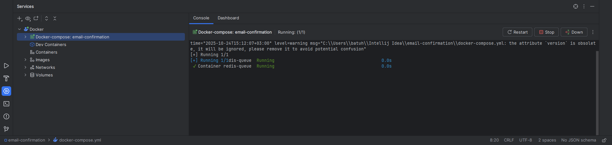
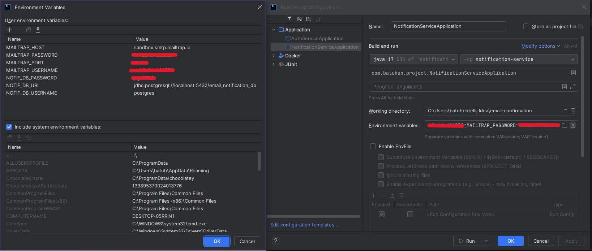
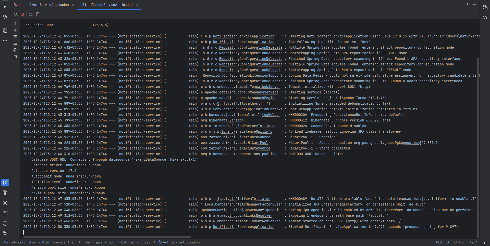
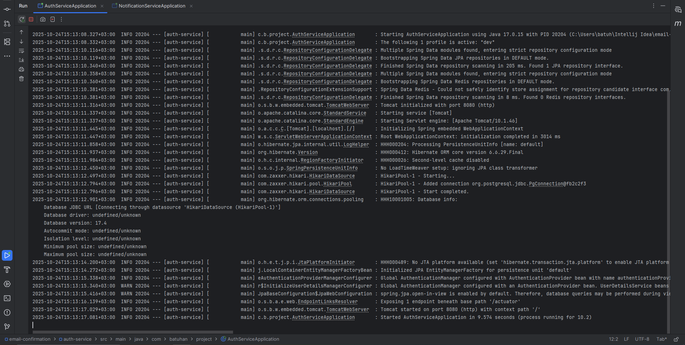
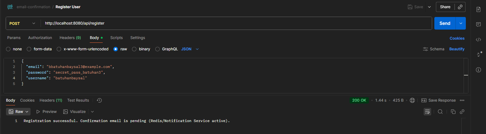
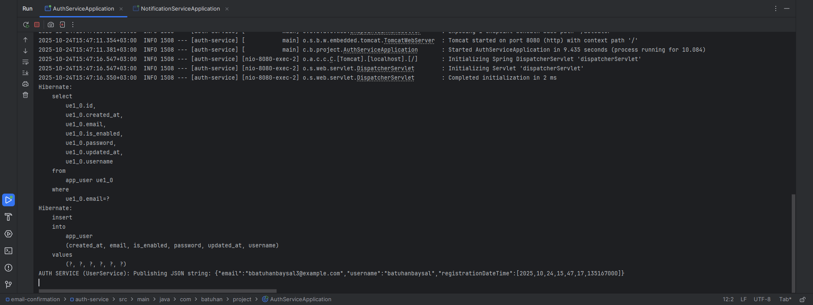
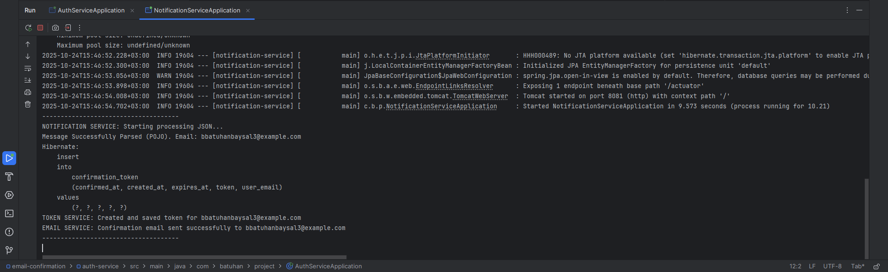
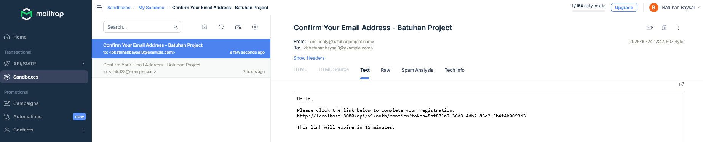

# 🚀 Event-Driven Mikroservisler ile Güvenli E-posta Onay Sistemi

Bu proje, modern bir **Event-Driven Mimariyi** (Olay Odaklı Mimari) kullanarak kullanıcı kayıt süreçlerini yöneten iki kritik mikroservisten oluşmaktadır. Amaç, kullanıcı kaydının hemen ardından e-posta onay sürecini **asenkron** ve **güvenli** bir şekilde başlatmaktır.

## 🌟 Temel Beceriler

Proje, dağıtık sistemler ve güncel backend geliştirme pratiklerindeki uzmanlığımı göstermektedir:

* **Mimari:** Dağıtık sistemler için Event-Driven (Olay Odaklı) mikroservis tasarımı.
* **Asenkron İletişim:** Yüksek verimli mesajlaşma için **Redis Pub/Sub** kullanımı.
* **Güvenlik:** **Spring Security** entegrasyonu ve JWT/BCrypt tabanlı kimlik doğrulama altyapısı.
* **Altyapı Yönetimi:** Geliştirme ortamı için **Docker** ve **Docker Compose** kullanımı.

---

## 💻 Kullanılan Teknolojiler Yığını

| Kategori | Teknoloji | Amaç |
| :--- | :--- | :--- |
| **Backend** | Java 17+, Spring Boot 3+ | Servis geliştirme ve hızlı uygulama çatısı. |
| **Veritabanı (Kalıcılık)** | PostgreSQL, Spring Data JPA | Kullanıcı ve Token bilgilerinin güvenilir saklanması. |
| **Mesajlaşma** | Redis (Pub/Sub) | Servisler arası hızlı ve asenkron olay iletişimi. |
| **Güvenlik** | Spring Security, JWT, BCrypt | Kimlik doğrulama ve şifre güvenliği. |
| **Altyapı & Konteyner** | **Docker, Docker Compose** | Altyapı servislerini (DB, Redis) taşınabilir ve hızlıca ayağa kaldırma. |
| **Test ve Geliştirme** | IntelliJ IDEA, Postman, Mailtrap | IDE, API testi ve e-posta test aracı. |

---

## 📐 Mimari ve Çalışma Akışı

Proje, **Auth Service (Yayıncı)** ve **Notification Service (Dinleyici)** olmak üzere iki ana servisten oluşur.

### Akış Senaryosu: Yeni Kullanıcı Kaydı

1.  **Kayıt İsteği:** Kullanıcı, `Auth Service`'e kayıt isteği gönderir.
2.  **Olay Yayınlama:** `Auth Service`, kullanıcıyı kaydettikten hemen sonra `UserRegisteredEvent` olayını Redis kanalına **asenkron** olarak yayınlar.
3.  **Olay Dinleme:** `Notification Service`, Redis kanalını dinler ve olayı yakalar.
4.  **Token ve Kayıt:** `Notification Service`, PostgreSQL'e onay token'ı oluşturur ve kaydeder.
5.  **E-posta Gönderimi:** `Notification Service`, Mailtrap üzerinden onay linkini kullanıcıya iletir.

---

## 🛠️ Kurulum Kılavuzu ve Testler

### 1. Altyapıyı Başlatma (Docker)

Bu proje, PostgreSQL ve Redis servislerini Docker üzerinden yönetmektedir. Docker'ı kullanarak altyapı servislerini başlatın:

```bash
   docker compose up -d
```

> **[Terminal: DOCKER - BAŞARILI BAŞLATMA]**


### 2. Ortam Değişkenlerini Ayarlama

Hassas verilerin (veritabanı şifreleri, Mailtrap kimlik bilgileri) doğrudan kodda veya genel konfigürasyon dosyasında tutulmasını **önlemek** amacıyla, bu değerler ortam değişkenleri üzerinden alınmalıdır.

**IntelliJ IDEA Adımları:**

1.  Proje penceresinde, çalıştırmak istediğiniz servisin (örn. `AuthServiceApplication`) yanındaki **Run/Debug Configurations** menüsünü açın.
2.  **"Edit Configurations..."** seçeneğine tıklayın.
3.  Sağ taraftaki panelde **"Environment variables"** (Ortam değişkenleri) alanını bulun ve yanındaki **"..."** (üç nokta) simgesine tıklayın.
4.  Aşağıdaki tablodaki tüm değişken adlarını ve kendi yerel değerlerinizi girin.

| Servis | Amaç | Değişken Adı | Örnek Değer (Lokal) |
| :--- | :--- | :--- | :--- |
| **Auth Service** | PostgreSQL Bağlantısı | `AUTH_DB_PASSWORD` | `default_dev_pass` |
| **Notification Service** | PostgreSQL Bağlantısı | `NOTIF_DB_PASSWORD` | `default_dev_pass` |
| **Notification Service** | Mailtrap Şifresi | `MAILTRAP_PASSWORD` | `default_mailtrap_pass` |

> **[INTELLIJ ENVIRONMENT VARIABLES PENCERESİ]**


Bu değişkenler, uygulama konfigürasyonunda (örneğin `auth-service/application.yml`'da) şu şekilde çağrılmaktadır:

```yaml
spring:
  datasource:
    password: ${AUTH_DB_PASSWORD:default_dev_pass} # Ortamdan alınır
```

### 3. Uygulamaları Başlatma Sırası

Önce `NotificationServiceApplication`'ı (Port: 8081), ardından `AuthServiceApplication`'ı (Port: 8080) başlatın.

> **[Terminal: NotificationServiceApplication - BAŞARILI BAŞLATMA]**


> **[Terminal: AuthServiceApplication - BAŞARILI BAŞLATMA]**



### 4. Akış Testi (Postman)

Kullanıcı kayıt akışını test etmek için:

* **Metot:** `POST`
* **URL:** `http://localhost:8080/api/v1/auth/register`

Konsolda, her iki servisten de gelen başarılı çıktılar.

> **[POSTMAN BAŞARILI İSTEK]**


> **[AUTH TERMİNAL KONSOL ÇIKTISI]**


> **[NOTİFİCATİON TERMİNAL KONSOL ÇIKTISI]**


### 5. E-posta Onay Kontrolü

Mailtrap gelen kutusunda, beklenen gönderen ve onay linki ile e-postanın geldiğini çıktı.

> **[MAILTRAP GELEN KUTUSU: BAŞARILI MAIL]**


---

## 📊 İzleme ve Geliştirme Notları

### Sağlık Kontrolü (Actuator)

En kritik izleme bilgisi olan `health` kontrolü çalışmaktadır. Bu, PostgreSQL ve Redis bağlantılarının durumunu doğrular.

* **Endpoint:** `http://localhost:8080/actuator/health` ve `http://localhost:8081/actuator/health`

### Bilinen Sınırlamalar ve Geliştirme Planı

1.  **Actuator Endpoint Kapsamı:** Konfigürasyon doğru olmasına rağmen, şu anki kurulumda Actuator sadece `/health` endpoint'ini göstermektedir. Diğer izleme yolları (`/metrics`, `/info`, `/env`) 404/403 hatası vermektedir.
2.  **Token Doğrulama Mantığı:** Projenin bir sonraki aşamasında, Auth Service'teki token doğrulama mantığı (`/confirm?token=...`) tamamlanacak ve kullanıcı aktivasyonu gerçekleştirilecektir.
3.  **İlkel Tip İletişimi:** Redis üzerinden JSON String yerine, tip güvenliğini artırmak için ayrı bir `core-events` Maven modülünde POJO'lar kullanılması planlanmaktadır.
